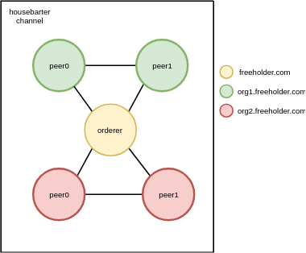

# House-Recording
Demonstration of a simple application based on hyperledger fabric to record purchases and sales of houses.

This example was created for the `Basics of Grid and Cloud Computing` course.

You can find more detailed information in the [presentation](https://docs.google.com/presentation/d/1AB_-mCfORa8xObqt-_W4U8IVMZvg8V53LNSvqjOXeSM/edit?usp=sharing)

## Before the start
Before starting the project, make sure that you have all the required dependencies. You can find them [here](https://hyperledger-fabric.readthedocs.io/en/release-1.4/prereqs.html).

## Launch of the project
Just go to `house-recording-network` and run `build_network.sh` script.

## Structure of the network
The network has the following structure

Each organization has 2 peers. The `peer0` is responsible for updating the state of the ledger using the `createHouseTransaction` smart contract method. 
The peer1 reads the state of the ledger using the `queryAllHouses` method. Also, `peer1` can obtain information about a specific transaction using the `queryHouse` method.

## Demo

